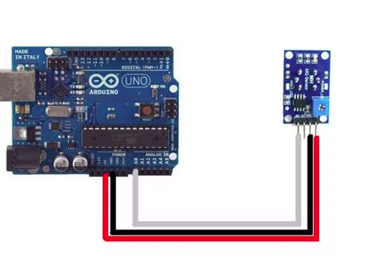

# arduino-pollution
This is a low-cost pollution sensor connected to my arduino. It can be used to detect changes in air quality, but can be extended to a range of components, for example an NOx sensor.
Components: Arduino UNO WiFi Rev2, Olimex SNS-MQ135
Sources:
https://www.arduino.cc/en/Reference/WiFiNINAClient
https://www.youtube.com/watch?v=DxZez4k0CK4
https://create.arduino.cc/projecthub/m_karim02/arduino-and-mq-135-gas-sensor-with-arduino-code-a8c1c6
The code in this repository makes an HTTP request to my Flask Webserver, and collects data from the sensor. I used WiFiNINA libraries and the code from the Arduino website to do this. I followed the instructions from the video to connect the sensor to the arduino, and stripped down the code from these sources to start collecting data. 

